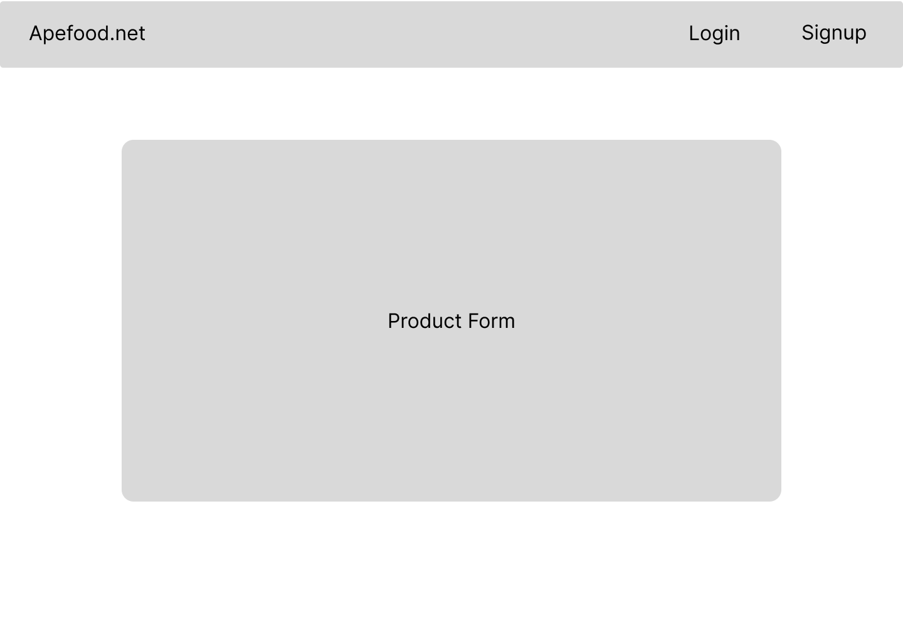

# Ape food
### Our innovative platform harmonizes the appetites of individuals and families with the expertise of local microgreen growers and homegrown food producers. In addition to fostering a sustainable food culture, we invite contributors to partake in our donation-driven approach, enhancing the accessibility of wholesome nutrition for all.

# Technologies used:
* HTML 
* CSS
* JavaScript
* MongoDB
* React
* express
* Three.js
* Google api
* Figma

# Links: 
- [Ape food Trello board](https://trello.com/b/2Nur9hRb/apefoodnet)
- [Deployed Site](https://u3proapefe.vercel.app/)

# React routes :
| ENDPOINT         | METHOD        | PURPOSE |
|------------------|-------------|---------|
|/            |  GET        | Show all products |
|/:id      |    GET     | Show a single product |
|/Create     |  POST   |  Create a product |
|/Update/:id      |  PUT    | Edit a product |
|/Delete/:id       |  DELETE       | Remove a product from the db |

# List of Components :
| COMPONENT        |    PURPOSE    |
|------------------|---------|
|/farmdesign        | Template design for all pages |
|/productdesign      | Used for  product creation |

# User features
- Ratings
- Favorite button

# Mockup:

# Farmer login Page    Farmer signup Page  User signup  User Login  Home Page  Adding a product page  Product page for farmer  Product page for user 

Click [here]() to visit our webiste !